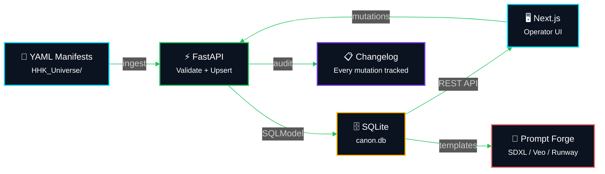
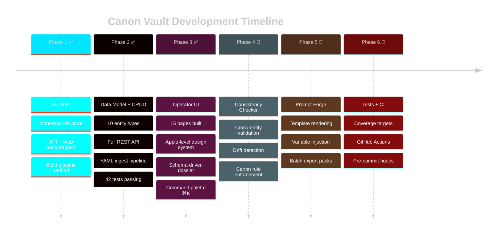

<div align="center">

<!-- Cyberpunk wave header -->


<!-- Multi-line typing animation -->
<a href="https://git.io/typing-svg">
  
</a>

<br/>

<!-- Premium badges -->
<p>
  <a href="https://github.com/LLParis/canon-vault">
    
  </a>
  
  
  
</p>

<p>


</p>

</div>

---

<br/>

<div align="center">

## 🌌 MISSION VECTOR

</div>

```python
"""
Canon Vault — Canon Operating System v0.2
Lock the canon. Ship the prompts. Never drift.
"""

class CanonOperatingSystem:
    """Single source of truth for anime/IP worldbuilding"""

    def __init__(self):
        self.universe = "Dominion (Tear Drops)"
        self.architecture = "monorepo: api + web"
        self.philosophy = "api_is_truth"
        self.status = "operational"

    @property
    def capability_matrix(self) -> dict:
        """What the Canon Vault controls"""
        return {
            "entity_management": {
                "characters": ["v2_schema", "identity", "visual", "moveset", "forms"],
                "episodes": ["scripts", "scene_breakdown", "cast_links"],
                "chapters": ["arc_structure", "narrative_chain", "season_mapping"],
                "world": ["factions", "locations", "relationships", "power_systems"],
            },
            "governance": {
                "lock_state": ["draft", "review", "locked", "deprecated"],
                "changelog": ["every_mutation_tracked", "diff_snapshots", "audit_trail"],
                "versioning": ["per_field", "per_entity", "per_universe"],
                "guardrails": ["canon_rules", "consistency_checks", "drift_prevention"],
            },
            "prompt_forge": {
                "templates": ["sdxl", "veo", "runway", "custom_engines"],
                "rendering": ["variable_injection", "character_context", "scene_params"],
                "output": ["preview", "batch_export", "version_pinning"],
            },
            "ingest_pipeline": {
                "input": ["yaml_manifests", "drag_drop", "bulk_upload"],
                "processing": ["validate", "deduplicate", "upsert"],
                "source": ["HHK_Universe_canon_data", "manual_entry", "api_import"],
            },
        }

    def operating_principle(self) -> str:
        return "Characters are the nucleus. Lock state, changelog visibility, " \
               "and ingest readiness stay in the foreground at all times."

# Boot the canon
canon = CanonOperatingSystem()
assert canon.philosophy == "api_is_truth", "The API is the single source of truth"
```

<br/>

---

<div align="center">


## 🏗️ SYSTEM ARCHITECTURE

</div>

```ascii
╔═══════════════════════════════════════════════════════════════════════════╗
║                                                                           ║
║                    ⚡ CANON VAULT v0.2 — SYSTEM TOPOLOGY ⚡                ║
║                                                                           ║
║   ┌─────────────────────────────────────────────────────────────────┐     ║
║   │                        apps/web (Next.js 16)                    │     ║
║   │  ┌──────────────┐  ┌──────────────┐  ┌───────────────────────┐ │     ║
║   │  │  App Router   │  │  TanStack    │  │  Zustand Store        │ │     ║
║   │  │  15 pages     │  │  Query v5    │  │  (persisted)          │ │     ║
║   │  │  SSR + CSR    │  │  cache mgmt  │  │  universe / palette   │ │     ║
║   │  └──────┬───────┘  └──────┬───────┘  └───────────┬───────────┘ │     ║
║   │         │                 │                       │             │     ║
║   │  ┌──────┴─────────────────┴───────────────────────┴───────────┐ │     ║
║   │  │  Components: SectionPanel · EntityCard · CommandPalette ⌘K │ │     ║
║   │  │  CharacterDossier (schema-driven) · ScriptViewer · JSON    │ │     ║
║   │  └────────────────────────┬───────────────────────────────────┘ │     ║
║   └───────────────────────────┼─────────────────────────────────────┘     ║
║                               │ REST /api/v1/*                            ║
║   ┌───────────────────────────┼─────────────────────────────────────┐     ║
║   │                    apps/api (FastAPI)                            │     ║
║   │  ┌────────────────────────┴───────────────────────────────────┐ │     ║
║   │  │  Routers: universes · characters · episodes · chapters     │ │     ║
║   │  │           relationships · factions · locations · ingest     │ │     ║
║   │  │           prompt_templates                                  │ │     ║
║   │  └────────────────────────┬───────────────────────────────────┘ │     ║
║   │  ┌────────────────────────┴───────────────────────────────────┐ │     ║
║   │  │  Services: changelog · ingest · script_reader              │ │     ║
║   │  │  Models: SQLModel + Pydantic v2 (10 entity types)          │ │     ║
║   │  └────────────────────────┬───────────────────────────────────┘ │     ║
║   │                           │                                     │     ║
║   │  ┌────────────────────────┴───────────────────────────────────┐ │     ║
║   │  │  SQLite (canon.db) — local-first, zero config              │ │     ║
║   │  │  42 tests passing · ruff clean · full CRUD + governance    │ │     ║
║   │  └───────────────────────────────────────────────────────────┘ │     ║
║   └─────────────────────────────────────────────────────────────────┘     ║
║                                                                           ║
║   ┌─────────────────────────────────────────────────────────────────┐     ║
║   │  📁 Canon Source: D:\07_ANIME\01_PROJECTS\HHK_Universe          │     ║
║   │     YAML manifests → Ingest pipeline → Validate → Upsert → DB  │     ║
║   └─────────────────────────────────────────────────────────────────┘     ║
║                                                                           ║
╚═══════════════════════════════════════════════════════════════════════════╝
```

<br/>

---

<div align="center">


## ⚡ CANON PIPELINE

</div>



<br/>

---

<div align="center">


## 💻 TECHNOLOGY STACK & TOOLCHAIN

</div>

<table>
<tr>
<td width="33%" valign="top">

<div align="center">

### ⚡ Backend — API Layer


</div>

```yaml
framework: FastAPI 0.115+
orm: SQLModel (SQLAlchemy core)
database: SQLite (local-first)
validation: Pydantic v2
migrations: Alembic
server: Uvicorn
yaml_parsing: PyYAML + ruamel
fuzzy_search: RapidFuzz
```

</td>
<td width="33%" valign="top">

<div align="center">

### 🖥️ Frontend — Operator UI


</div>

```yaml
framework: Next.js 16 (App Router)
language: TypeScript 5.x
styling: Tailwind CSS 4
state: Zustand (persisted)
data_fetching: TanStack Query v5
icons: Lucide React
types: openapi-typescript (generated)
design: Apple-level dark mode
```

</td>
<td width="33%" valign="top">

<div align="center">

### 🔧 Tooling & Quality


</div>

```yaml
python_lint: Ruff (format + check)
python_test: Pytest (42 tests)
js_lint: ESLint + Prettier
type_gen: openapi-typescript
vcs: Git + GitHub
editor: VSCode
shell: Git Bash (Windows 11)
ci: Manual (Phase 6 target)
```

</td>
</tr>
</table>

<br/>

---

<div align="center">


## 📊 ENTITY MODEL & GOVERNANCE

</div>

<table>
<tr>
<td width="50%" valign="top">

<div align="center">

### 🗂️ Canon Entities


</div>

```yaml
characters:
  schema: v2 (richest entity)
  sections:
    - identity (name, codename, faction, tier)
    - visual (design notes, color palette)
    - personality (traits, quirks, voice)
    - moveset (abilities, canon_rules, themes)
    - forms (transformations, arc_phases, hooks)
  features:
    - schema-driven dossier tabs
    - per-field versioning
    - prompt_description for AI context

episodes:
  - name, season, episode_number
  - script linking (full text viewer)
  - scene breakdowns + cast links
  - status governance

chapters:
  - arc structure + season mapping
  - narrative chain ordering
  - episode grouping

world:
  - factions (ideology, leadership)
  - locations (region, coordinates)
  - relationships (character ↔ character)
  - relationship_type + dynamic text

prompt_templates:
  - engine: sdxl / veo / runway / custom
  - template body with variable slots
  - render preview + output export
```

</td>
<td width="50%" valign="top">

<div align="center">

### 🔒 Governance System


</div>

```yaml
status_lifecycle:
  states: [draft, review, locked, deprecated]
  transitions:
    - draft → review (ready for inspection)
    - review → locked (canon-sealed)
    - locked → review (unlock for edits)
    - any → deprecated (soft delete)
  enforcement:
    - locked entities reject mutations
    - status changes logged to changelog

changelog_ledger:
  tracks: every mutation on every entity
  captures:
    - entity_type + entity_id
    - field changed + old/new values
    - timestamp + action type
    - diff snapshots for rollback context
  display:
    - timeline UI with color-coded diffs
    - additions (green) / removals (red)
    - filterable by entity and date

version_control:
  - per-entity version counter
  - increments on every update
  - locked_at timestamp for seal date
  - universe-scoped isolation

ingest_pipeline:
  input: YAML manifests (drag + drop)
  steps:
    - parse + validate against schema
    - deduplicate by canon_id
    - upsert (create or update)
    - log all changes to changelog
  source: HHK_Universe canon data
```

</td>
</tr>
</table>

<br/>

---

<div align="center">


## 🖥️ OPERATOR UI — FEATURE MAP

</div>

<table>
<tr>
<td width="33%" align="center">

### 🎛️ Control Surface
<br/>

Dashboard with live stats
<br/>
Universe footprint counts
<br/>
Spotlight: recent dossiers
<br/>
Quick-action launchers
<br/>
Reviewed / locked counters

</td>
<td width="33%" align="center">

### ⌘ Command Palette
<br/>

`Ctrl+K` global search
<br/>
All entities indexed
<br/>
Fuzzy match across names
<br/>
Jump to any page instantly
<br/>
Groups: Navigate · Entities

</td>
<td width="33%" align="center">

### 📋 Schema-Driven Dossier
<br/>

Config-driven tab system
<br/>
Add field = one config entry
<br/>
Zero new JSX required
<br/>
Recursive JSON renderer
<br/>
Relationships + Changelog tabs

</td>
</tr>
<tr>
<td width="33%" align="center">

### 📜 Script Viewer
<br/>

Full episode scripts
<br/>
Line-numbered display
<br/>
Source type + line count
<br/>
File path reference
<br/>
72vh scrollable viewport

</td>
<td width="33%" align="center">

### 🔍 Inspector Panel
<br/>

Slide-out side panel
<br/>
Quick entity preview
<br/>
Toggle with hotkey
<br/>
Non-blocking workflow
<br/>
Density settings

</td>
<td width="33%" align="center">

### 🌐 Multi-Universe
<br/>

Universe switcher sidebar
<br/>
Scoped data isolation
<br/>
Persisted selection
<br/>
Create new universes
<br/>
Per-universe entity counts

</td>
</tr>
</table>

<br/>

---

<div align="center">


## 📂 PROJECT STRUCTURE

</div>

```
canon-vault/
├── apps/
│   ├── api/                              # ⚡ FastAPI backend (single source of truth)
│   │   ├── app/
│   │   │   ├── models/                   # SQLModel entity definitions
│   │   │   │   ├── character.py          #   v2 schema — identity, visual, moveset, forms
│   │   │   │   ├── episode.py            #   episodes + script linking
│   │   │   │   ├── chapter.py            #   chapters + arc structure
│   │   │   │   ├── relationship.py       #   character ↔ character edges
│   │   │   │   ├── faction.py            #   faction entities
│   │   │   │   ├── location.py           #   world geography
│   │   │   │   ├── prompt_template.py    #   Prompt Forge templates
│   │   │   │   ├── changelog.py          #   mutation audit ledger
│   │   │   │   ├── universe.py           #   multi-universe support
│   │   │   │   └── _base.py              #   shared base model
│   │   │   ├── routers/                  # RESTful /api/v1/* endpoints (9 routers)
│   │   │   ├── services/                 # Business logic (ingest, changelog, scripts)
│   │   │   └── main.py                   # App entrypoint + CORS + lifespan
│   │   ├── tests/                        # 42 tests — CRUD, governance, ingest, scripts
│   │   ├── data/                         # SQLite DB (gitignored)
│   │   └── pyproject.toml                # Python project config
│   │
│   └── web/                              # 🖥️ Next.js frontend (operator UI)
│       └── src/
│           ├── app/                       # App Router — 15 pages
│           │   ├── page.tsx               #   Dashboard control surface
│           │   ├── characters/            #   Cast registry + dossier detail
│           │   ├── episodes/              #   Episode list + script viewer
│           │   ├── chapters/              #   Chapter + arc browser
│           │   ├── relationships/         #   Relationship lattice
│           │   ├── factions/              #   Faction registry
│           │   ├── locations/             #   World map browser
│           │   ├── prompt-templates/      #   Prompt Forge UI
│           │   └── ingest/               #   YAML drop → validate → upsert
│           ├── components/                # Shared UI (12 components)
│           │   ├── app-shell.tsx           #   Sidebar + header + inspector
│           │   ├── command-palette.tsx     #   ⌘K global search
│           │   ├── character-dossier.tsx   #   Schema-driven tabbed dossier
│           │   ├── section-panel.tsx       #   Master panel wrapper
│           │   ├── entity-card.tsx         #   Reusable entity card
│           │   ├── entity-hero.tsx         #   Detail page hero header
│           │   ├── script-viewer.tsx       #   Full episode script renderer
│           │   ├── json-section.tsx        #   Recursive JSON renderer
│           │   ├── changelog-timeline.tsx  #   Audit log timeline
│           │   ├── status-badge.tsx        #   Semantic status chips
│           │   ├── page-header.tsx         #   List page header
│           │   ├── empty-state.tsx         #   Empty/error placeholders
│           │   └── loading-state.tsx       #   Loading skeletons
│           └── lib/
│               ├── api/                   # API client + types
│               │   ├── client.ts          #   Fetch wrapper
│               │   ├── generated.ts       #   openapi-typescript output
│               │   └── types.ts           #   Re-exports + manual types
│               ├── dossier-schema.ts      #   Config-driven dossier tabs
│               ├── navigation.ts          #   Sidebar nav items
│               ├── utils.ts               #   Formatters + helpers
│               └── store/
│                   └── canon-store.ts     #   Zustand persisted store
│
├── CLAUDE.md                              # Project rules for Claude Code
└── README.md                              # You are here
```

<br/>

---

<div align="center">


## 🚀 QUICK START

</div>

### 1. Clone

```bash
git clone https://github.com/LLParis/canon-vault.git
cd canon-vault
```

### 2. Backend (API)

```bash
cd apps/api
python -m venv .venv
source .venv/Scripts/activate    # Windows (Git Bash)
# source .venv/bin/activate      # macOS / Linux
pip install -e ".[dev]"

# Boot the API
python -m uvicorn app.main:app --reload --port 8001
```

| Endpoint | URL |
|:---------|:----|
| 🟢 Health check | `http://localhost:8001/health` |
| 📖 API docs (Swagger) | `http://localhost:8001/docs` |
| 📋 OpenAPI spec | `http://localhost:8001/openapi.json` |

### 3. Frontend (Web)

```bash
cd apps/web
npm install
npm run dev
```

| Endpoint | URL |
|:---------|:----|
| 🖥️ Dashboard | `http://localhost:3000` |

### 4. Verify

```bash
# Backend tests (42 passing)
cd apps/api && source .venv/Scripts/activate
pytest

# Lint check
ruff check . && ruff format --check .

# Frontend build
cd apps/web && npm run build
```

<br/>

---

<div align="center">


## 🗺️ ROADMAP & PHASE STATUS

</div>



<br/>

<table>
<tr>
<td width="25%" align="center">

### ✅ PHASE 1
**Scaffold**
<br/><br/>
Monorepo boots
<br/>
API + Web ready
<br/>
Build verified
<br/>
Git initialized

</td>
<td width="25%" align="center">

### ✅ PHASE 2
**Data + CRUD**
<br/><br/>
10 entity types
<br/>
Full REST API
<br/>
YAML ingest
<br/>
42 tests passing

</td>
<td width="25%" align="center">

### ✅ PHASE 3
**Operator UI**
<br/><br/>
15 pages built
<br/>
Apple design system
<br/>
Schema dossier
<br/>
Command palette

</td>
<td width="25%" align="center">

### 🔵 PHASE 4-6
**Next Up**
<br/><br/>
Consistency checks
<br/>
Prompt Forge render
<br/>
Export packs
<br/>
CI pipeline

</td>
</tr>
</table>

<br/>

---

<br/>

<div align="center">

## ⚡ CORE PRINCIPLES

</div>

```ascii
╔═══════════════════════════════════════════════════════════════════════════╗
║                                                                           ║
║                ⚡ LOCK THE CANON. SHIP THE PROMPTS. ⚡                    ║
║                                                                           ║
║   "The API is the single source of truth. The frontend never touches     ║
║    the database. Every mutation is tracked. Drift is the enemy."         ║
║                                                                           ║
║   ┌─────────────────────────────────────────────────────────────┐       ║
║   │  ✓  API is the single source of truth — always              │       ║
║   │  ✓  Every mutation logged to the changelog ledger            │       ║
║   │  ✓  Lock state enforced — locked entities reject writes      │       ║
║   │  ✓  Schema-driven UI — add a field, zero new JSX             │       ║
║   │  ✓  Local-first — SQLite, no cloud dependency                │       ║
║   │                                                              │       ║
║   │  ✗  No second database in the frontend                      │       ║
║   │  ✗  No magic refactors or unnecessary abstractions           │       ║
║   │  ✗  No features beyond what's requested                      │       ║
║   │  ✗  No Docker unless explicitly asked                        │       ║
║   └─────────────────────────────────────────────────────────────┘       ║
║                                                                           ║
║   Characters remain the nucleus. Lock state, changelog visibility,       ║
║   and ingest readiness stay in the foreground at all times.              ║
║                                                                           ║
╚═══════════════════════════════════════════════════════════════════════════╝
```

<br/>

---

<div align="center">

### 🎯 Universe: **Dominion (Tear Drops)**
### 🚀 Status: **Operational — Phases 1-3 Complete**
### 🌟 Next: **Consistency Checker + Prompt Forge Rendering**

<br/>

---


<br/>

**[⬆ Back to Top](#canon-vault)** • Built with 💜 by LLParis • Canon Vault v0.2

</div>
