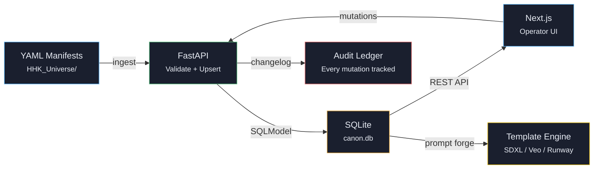

<div align="center">


<a href="https://github.com/LLParis/canon-vault">
  
</a>

<br/>


</div>

---

## System Architecture

```
┌─────────────────────────────────────────────────────────────────┐
│                       CANON VAULT v0.2                          │
│              Single Source of Truth Architecture                │
├─────────────────────────────────────────────────────────────────┤
│                                                                 │
│   ┌───────────────────────┐     ┌────────────────────────────┐  │
│   │     apps/web          │     │      apps/api              │  │
│   │  ┌─────────────────┐  │     │  ┌──────────────────────┐  │  │
│   │  │  Next.js 16     │  │     │  │  FastAPI + SQLModel  │  │  │
│   │  │  App Router     │──┼─────┼──│  RESTful /api/v1/*   │  │  │
│   │  │  TanStack Query │  │REST │  │  Pydantic Schemas    │  │  │
│   │  │  Zustand Store  │  │     │  │  Alembic Migrations  │  │  │
│   │  └─────────────────┘  │     │  └──────────┬───────────┘  │  │
│   │                       │     │             │              │  │
│   │  ┌─────────────────┐  │     │  ┌──────────▼───────────┐  │  │
│   │  │  Components     │  │     │  │  SQLite (canon.db)   │  │  │
│   │  │  ─────────────  │  │     │  │  ─────────────────── │  │  │
│   │  │  Section Panel  │  │     │  │  Universes           │  │  │
│   │  │  Entity Card    │  │     │  │  Characters (v2)     │  │  │
│   │  │  Command ⌘K     │  │     │  │  Episodes + Scripts  │  │  │
│   │  │  JSON Renderer  │  │     │  │  Chapters + Arcs     │  │  │
│   │  │  Script Viewer  │  │     │  │  Relationships       │  │  │
│   │  │  Dossier Schema │  │     │  │  Factions + Locs     │  │  │
│   │  └─────────────────┘  │     │  │  Prompt Templates    │  │  │
│   └───────────────────────┘     │  │  Changelog Ledger    │  │  │
│                                 │  └──────────────────────┘  │  │
│                                 └────────────────────────────┘  │
│                                                                 │
│   ┌─────────────────────────────────────────────────────────┐   │
│   │                  Canon Reference Data                    │   │
│   │        D:\07_ANIME\01_PROJECTS\HHK_Universe             │   │
│   │        YAML manifests → Ingest pipeline → DB             │   │
│   └─────────────────────────────────────────────────────────┘   │
└─────────────────────────────────────────────────────────────────┘
```

---

## Canon Pipeline



---

## Tech Stack

<div align="center">

| Backend | Frontend | Tooling |
|:--------|:---------|:--------|
| Python 3.11+ | Next.js 16 (App Router) | Ruff (lint + format) |
| FastAPI 0.115+ | TypeScript 5.x | Pytest (42 tests) |
| SQLModel + SQLite | TanStack Query v5 | openapi-typescript |
| Pydantic v2 | Zustand (persisted) | ESLint + Prettier |
| Uvicorn | Tailwind CSS 4 | Alembic (migrations) |
| PyYAML | Lucide Icons | Git Bash (Windows) |

</div>

---

## Entity Model

<div align="center">

| Canon Entities | Governance | Prompt Forge |
|:---------------|:-----------|:-------------|
| Characters (v2 schema) | Lock / Unlock state | Prompt Templates |
| Episodes + Scripts | Changelog ledger | SDXL / Veo / Runway |
| Chapters + Arcs | Status: draft → locked | Template rendering |
| Factions | Version tracking | Variable injection |
| Locations | Canon guardrails | Output preview |
| Relationships | Per-field versioning | Batch export |

</div>

---

## Project Structure

```
canon-vault/
├── apps/
│   ├── api/                          # FastAPI backend
│   │   ├── app/
│   │   │   ├── models/               # SQLModel entities
│   │   │   │   ├── character.py      # v2 schema — identity, visual, moveset, forms
│   │   │   │   ├── episode.py        # Episodes + script linking
│   │   │   │   ├── chapter.py        # Chapters + arc structure
│   │   │   │   ├── relationship.py   # Character ↔ Character edges
│   │   │   │   ├── faction.py        # Faction entities
│   │   │   │   ├── location.py       # World geography
│   │   │   │   ├── prompt_template.py# Prompt Forge templates
│   │   │   │   ├── changelog.py      # Mutation audit ledger
│   │   │   │   └── universe.py       # Multi-universe support
│   │   │   ├── routers/              # RESTful /api/v1/* endpoints
│   │   │   ├── services/             # Ingest, changelog, script reader
│   │   │   └── main.py               # App entrypoint + CORS
│   │   ├── tests/                    # 42 tests — CRUD, governance, ingest
│   │   └── pyproject.toml
│   │
│   └── web/                          # Next.js frontend
│       └── src/
│           ├── app/                   # App Router pages
│           │   ├── page.tsx           # Dashboard — control surface
│           │   ├── characters/        # Cast registry + dossier detail
│           │   ├── episodes/          # Episode list + script viewer
│           │   ├── chapters/          # Chapter + arc browser
│           │   ├── relationships/     # Relationship lattice
│           │   ├── factions/          # Faction registry
│           │   ├── locations/         # World map browser
│           │   ├── prompt-templates/  # Prompt Forge UI
│           │   └── ingest/            # YAML drop + validate + upsert
│           ├── components/            # Shared UI components
│           │   ├── app-shell.tsx      # Sidebar + header + inspector
│           │   ├── command-palette.tsx # ⌘K global search
│           │   ├── character-dossier.tsx # Schema-driven tabbed dossier
│           │   ├── section-panel.tsx   # Master panel wrapper
│           │   ├── entity-card.tsx     # Reusable entity card
│           │   └── script-viewer.tsx   # Full episode script renderer
│           └── lib/
│               ├── api/               # Client, generated types, manual types
│               ├── dossier-schema.ts   # Config-driven dossier tabs
│               └── store/             # Zustand persisted store
│
├── CLAUDE.md                          # Project rules for Claude Code
└── README.md
```

---

## Quick Start

### 1. Clone

```bash
git clone https://github.com/LLParis/canon-vault.git
cd canon-vault
```

### 2. Backend

```bash
cd apps/api
python -m venv .venv
source .venv/Scripts/activate    # Windows (Git Bash)
# source .venv/bin/activate      # macOS / Linux
pip install -e ".[dev]"

# Run API
python -m uvicorn app.main:app --reload --port 8001
```

| Endpoint | URL |
|:---------|:----|
| Health check | `http://localhost:8001/health` |
| API docs | `http://localhost:8001/docs` |
| OpenAPI spec | `http://localhost:8001/openapi.json` |

### 3. Frontend

```bash
cd apps/web
npm install
npm run dev
```

| Endpoint | URL |
|:---------|:----|
| Dashboard | `http://localhost:3000` |

### 4. Verify

```bash
# Backend tests (42 passing)
cd apps/api && source .venv/Scripts/activate && pytest

# Lint
ruff check . && ruff format --check .

# Frontend build
cd apps/web && npm run build
```

---

## Roadmap

- [x] **Phase 1** — Scaffold (repo boots cleanly)
- [x] **Phase 2** — Data model + CRUD + YAML ingest
- [x] **Phase 3** — Operator UI (Apple-level design, schema-driven dossier)
- [ ] **Phase 4** — Consistency checker (cross-entity validation)
- [ ] **Phase 5** — Prompt Forge (template rendering + export packs)
- [ ] **Phase 6** — Tests + guardrails (coverage targets, CI)

---

<div align="center">


<br/>

**Canon Vault** — *Lock the canon. Ship the prompts. Never drift.*

<br/>


</div>
